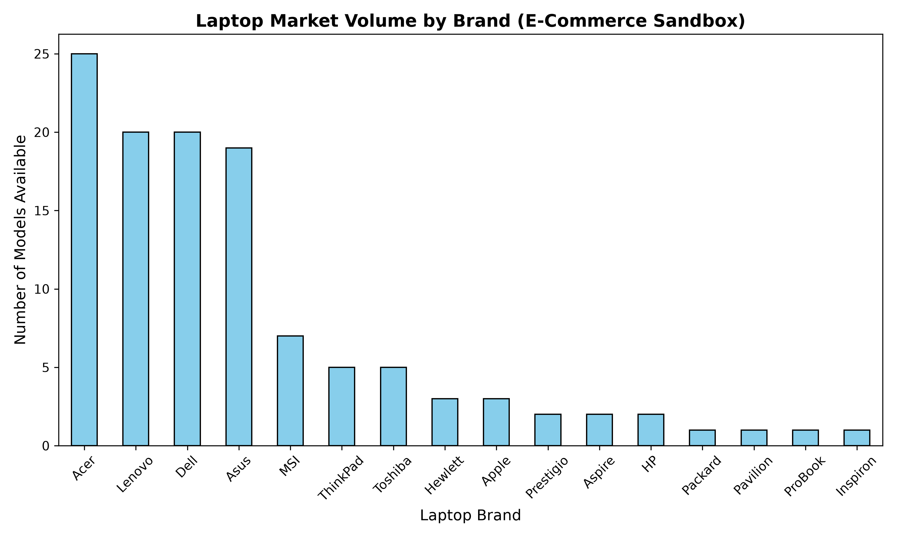

# 💻 E-Commerce Market Intelligence Pipeline

An end-to-end data analytics and machine learning pipeline built during my Data Analytics Internship at **CodeAlpha**. This project automates data ingestion, processes and cleans raw datasets, visualizes market distributions, and applies Natural Language Processing (NLP) to evaluate product text.

---

## 🛠️ Project Architecture & Task Breakdown

The project is structured into 4 sequential stages, with each task feeding directly into the next:

### 📡 Task 1: Web Scraping (`scraper.py`)
* **Role:** Automated data collection pipeline.
* **Details:** Extracts data from an e-commerce sandbox environment to gather laptop product names, pricing strings, and text specifications.
* **Output:** Saves 117 raw entries into `raw_market_intelligence.csv`.

### 🧮 Task 2: Exploratory Data Analysis & Cleaning (`eda.py`)
* **Role:** Data engineering and descriptive statistics.
* **Details:** Strips currency characters, formats variables into clean numerical data types, handles feature engineering to isolate laptop brand names, and computes minimum, maximum, and average market pricing metrics.
* **Output:** Saves structured dataset to `cleaned_market_intelligence.csv`.

### 📊 Task 3: Data Visualization (`visualizations.py`)
* **Role:** Market share visual representation.
* **Details:** Utilizes `matplotlib` to group data records and map out product presence across brands.
* **Output:** Saves a high-resolution bar chart visualization as `brand_market_volume.png`.

### 🧠 Task 4: Sentiment Analysis NLP Model (`sentiment_analysis.py`)
* **Role:** Algorithmic text interpretation.
* **Details:** Leverages the `NLTK VADER` sentiment model to evaluate technical specifications and accurately tag records as **Positive, Neutral, or Negative**.
* **Output:** Compiles the final feature matrix into `final_market_intelligence.csv`.

---

## 📈 Visualizing Market Share

Below is the distribution chart automatically generated by the pipeline showing unique laptop configurations available per manufacturer:



---

## ⚙️ Environment Setup & Execution

### 1. Installation
Ensure you have the necessary tracking and computation libraries installed on your machine:
```bash
pip install pandas matplotlib nltk